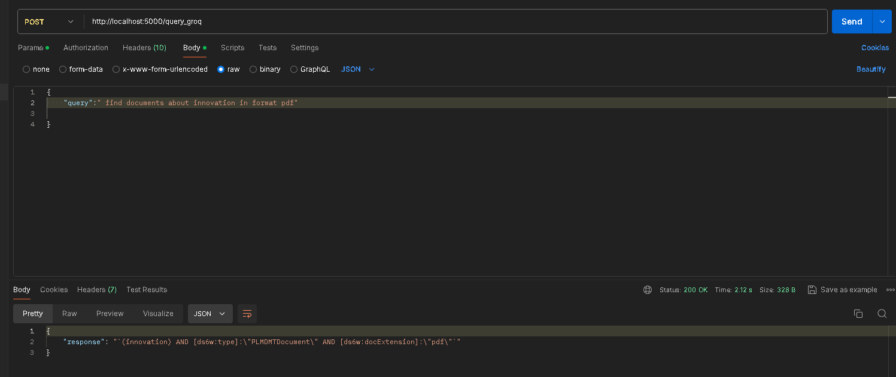
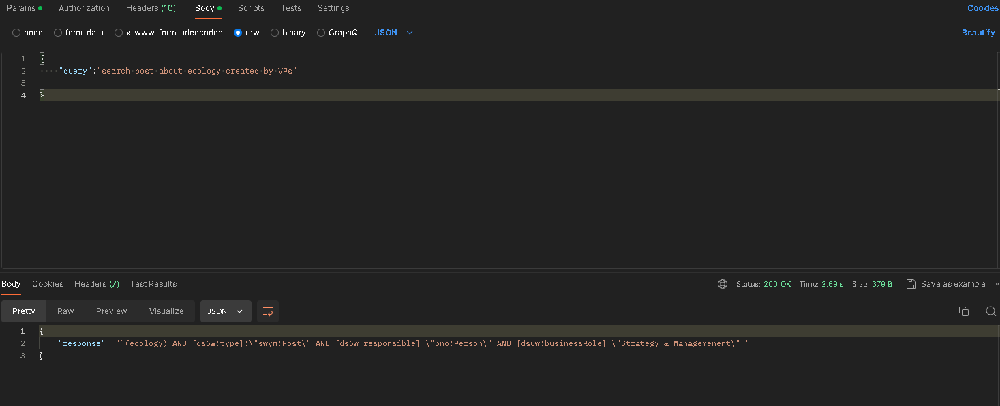
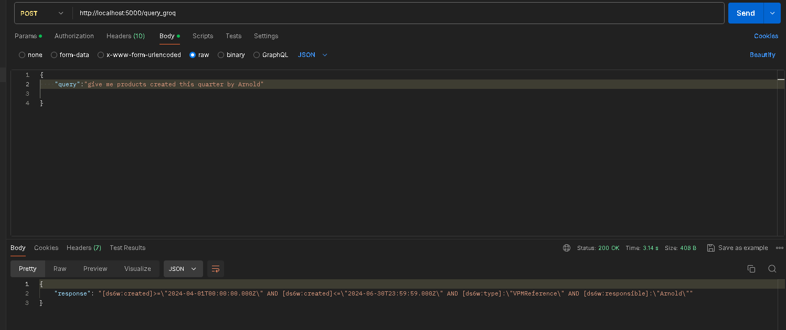
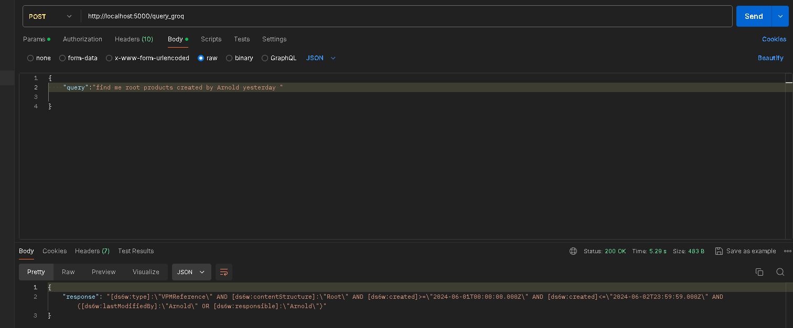

# NLQ to UQL Conversion POC

This proof of concept (POC) demonstrates the conversion of Natural Language Queries (NLQ) into Uniform Query Language (UQL) based on RDF data models. Utilizing prompt engineering techniques and the LLM LLama3 hosted on the Foundation Model API, this project aims to provide a robust method for translating complex natural language into structured queries that adhere to predefined RDF ontologies.

## Detailed Conversion Process

1. **Identify Key Components**:
   Analyze the natural language query to determine the main entity (subject), the properties or relations (predicates), and the values or instances related to the predicates (objects).

2. **Map to RDF Concepts**:
   Use the ontology to correlate the identified natural language elements with the appropriate RDF classes and predicates.

3. **Fallback Mechanism for Unmapped Terms**:
  unmapped terms treated as a conceptual or textual search term that does not correspond directly to specific RDF ontology properties.

4. **Construct the UQL Query**:
   Synthesize the mapped elements into a UQL query following the defined syntax, ensuring alignment with the RDF ontology structure.

5. **Reflection Function**:
   Implement a reflection function that allows the LLM to review and correct its response to enhance accuracy and better handle exceptions.

## Installation

This project requires Docker Desktop or WSL (Windows Subsystem for Linux) installed on your machine. Follow these steps to set up the environment:

```bash
git clone https://github.com/asmaakremi/federated-search.git
cd federated-search
docker-compose up --build
```
## Results
Below are example images showcasing the transformation of NLQ into UQL:




